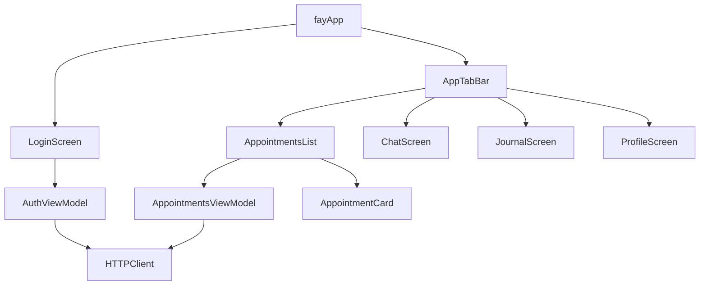

# Fay iOS App — Initial Build

## Architecture




Auth state (`token: String?`) lives in `fayApp` and is passed down. When `token` is nil, `LoginScreen` is shown; otherwise `AppTabBar` is shown.

## Files to Create

All new files get the standard header (`// fay`, `// Created by Cassie Wallace on 3/18/26`).

- `fay/Extensions/Color+Tokens.swift` — Type-safe `Color` static properties for all semantic tokens
- `fay/Resources/Copy.swift` — Namespaced `enum Copy` with nested enums per screen; all user-facing strings defined here as `static let` constants backed by `String(localized:)`
- `fay/Models/Appointment.swift` — `Appointment: Codable, Identifiable` with snake_case `CodingKeys`, ISO 8601 date decoding, and `AppointmentResponse` wrapper
- `fay/Services/HTTPClient.swift` — `async throws` methods `signIn(username:password:) -> String` and `fetchAppointments(token:) -> [Appointment]` using `URLSession`; accepts an injected `URLSession` (defaults to `.shared`) for testability
- `fay/ViewModels/AuthViewModel.swift` — `@Observable` class with `var isLoading`, `errorMessage`; exposes `signIn(email:password:)` async method
- `fay/ViewModels/AppointmentsViewModel.swift` — `@Observable` class with `var appointments: [Appointment]`; computed `upcomingAppointments` / `pastAppointments` sorted by `start`
- `fay/Views/LoginScreen.swift` — Email + password fields, Sign In button, error banner
- `fay/Views/AppTabBar.swift` — `TabView` with `.tabItem` and `.tint(.accentPrimary)`
- `fay/Views/AppointmentsList.swift` — `NavigationStack`, large title, "New" toolbar placeholder, `Picker` for Upcoming/Past, `ScrollView` of cards
- `fay/Views/AppointmentCard.swift` — Date badge, time+timezone, provider subtitle, conditional "Join appointment" button
- `fay/Views/ChatScreen.swift` / `JournalScreen.swift` / `ProfileScreen.swift` — Empty placeholder views
- `fay/Resources/Localizable.xcstrings` — String catalog for all user-facing strings

## Files to Modify

- `[fay/fayApp.swift](fay/fayApp.swift)` — Hold `@State private var token: String?`; show `LoginScreen` or `AppTabBar` conditionally
- `[fay/ContentView.swift](fay/ContentView.swift)` — Delete (replaced by dedicated view files)

## Key Implementation Details

### API & Auth

- `POST /signin` body: `{ "username": "john", "password": "12345" }`
- `GET /appointments` with `Authorization: Bearer {token}`
- Token held in-memory on `fayApp`; passed to views that need it
- `JSONDecoder.dateDecodingStrategy = .iso8601`

### Appointments Logic

- `upcomingAppointments`: `start >= Date.now`, ascending
- `pastAppointments`: `start < Date.now`, descending
- Provider name hardcoded as `"Jane Williams, RD"`
- "Join appointment" button shown only on `upcomingAppointments.first` (index 0)
- Button is a no-op

### Time & Localization

- Time range formatted with `Date.FormatStyle` using `TimeZone.current`; timezone abbreviation appended: `"11:00 AM – 12:00 PM (PT)"`
- Date components (month abbreviation, day) use `Calendar.current` and locale-aware formatters
- All user-facing strings are accessed exclusively through `Copy.*` — no inline string literals in views

`**Copy` enum structure (`fay/Resources/Copy.swift`):**

```swift
enum Copy {
    enum Login {
        static let emailPlaceholder  = String(localized: "login.email.placeholder",    defaultValue: "Email")
        static let passwordPlaceholder = String(localized: "login.password.placeholder", defaultValue: "Password")
        static let signInButton      = String(localized: "login.sign_in.button",        defaultValue: "Sign In")
        static let errorTitle        = String(localized: "login.error.title",           defaultValue: "Sign in failed")
    }

    enum Appointments {
        static let screenTitle   = String(localized: "appointments.screen.title",   defaultValue: "Appointments")
        static let newButton     = String(localized: "appointments.new.button",     defaultValue: "New")
        static let upcoming      = String(localized: "appointments.tab.upcoming",   defaultValue: "Upcoming")
        static let past          = String(localized: "appointments.tab.past",       defaultValue: "Past")
        static let joinButton    = String(localized: "appointments.join.button",    defaultValue: "Join appointment")
        static let followUp      = String(localized: "appointments.type.follow_up", defaultValue: "Follow up")
    }

    enum Tabs {
        static let appointments = String(localized: "tab.appointments", defaultValue: "Appointments")
        static let chat         = String(localized: "tab.chat",         defaultValue: "Chat")
        static let journal      = String(localized: "tab.journal",      defaultValue: "Journal")
        static let profile      = String(localized: "tab.profile",      defaultValue: "Profile")
    }
}
```

Keys in `Copy` map 1:1 to entries in `Localizable.xcstrings`. The `defaultValue:` parameter serves as both the English string and inline documentation — a translator or reviewer can read `Copy.swift` as a complete inventory of all app copy without opening the string catalog.

### Color System

All custom colors are defined as named color sets in `Assets.xcassets` with explicit light and dark mode values, then surfaced as type-safe static properties on `Color` via `Color+Tokens.swift`.


| Token               | Usage                                                   | Light     | Dark                                     |
| ------------------- | ------------------------------------------------------- | --------- | ---------------------------------------- |
| `accentPrimary`     | Buttons, tab tint, date badges, active picker indicator | `#6874E8` | `#7B85F0` (lighter for dark bg contrast) |
| `backgroundPrimary` | Screen backgrounds                                      | `#FFFFFF` | `#000000` (system)                       |
| `backgroundCard`    | Appointment card surfaces                               | `#FFFFFF` | `#1C1C1E`                                |
| `backgroundBadge`   | Aliased to `accentPrimary` (no separate asset needed)   | —         | —                                        |


System semantic colors (`Color.primary`, `Color.secondary`) are used directly for all body and subtitle text — no custom tokens needed there.

`AccentColor` in `Assets.xcassets` is updated to `#6874E8` / `#7B85F0` so `.tint(.accentColor)` and system controls pick it up automatically. `Color.accentPrimary` references this same asset.

```swift
// Color+Tokens.swift
extension Color {
    static let accentPrimary   = Color("AccentColor")      // reuses the standard AccentColor asset
    static let backgroundCard  = Color("BackgroundCard")
    static let backgroundPrimary = Color("BackgroundPrimary")
}
```

Every view uses these tokens instead of literal color values, ensuring light/dark correctness app-wide.

### Liquid Glass Strategy

- **Cards**: `#available(iOS 26, *)` → `.glassEffect(.regular, in: .rect(cornerRadius: 16))`; else → `.background(.white).clipShape(.rect(cornerRadius: 16)).shadow(color:.black.opacity(0.06), radius:4)`
- **"Join" button**: `#available(iOS 26, *)` → `.buttonStyle(.glassProminent)` with indigo tint; else → `.buttonStyle(.borderedProminent)` with indigo tint
- **Picker (Upcoming/Past)**: `#available(iOS 26, *)` → custom `GlassEffectContainer` segmented-style; else → `.pickerStyle(.segmented)`
- **Tab bar**: system handles Liquid Glass automatically on iOS 26+

### Accessibility

Audit approach follows the SwiftUI Accessibility Auditor skill, covering all seven categories at the right priority level.

#### P0 — Blockers (must ship with these)

**VoiceOver semantics**

- Icon-only "New" toolbar button gets `.accessibilityLabel(String(localized: "New appointment"))`
- Appointment card rows use `accessibilityElement(children: .combine)` with a fully composed label, e.g. *"November 8, 11:00 AM to 12:00 PM Pacific Time, Follow up with Jane Williams"* — avoids VoiceOver reading date badge, time, and subtitle as three separate, disconnected elements
- Date badge inner labels (month + day number) are hidden from VoiceOver with `.accessibilityHidden(true)` since the combined card label covers them
- "Join appointment" is a `Button`, giving VoiceOver the "button" trait and double-tap activation for free
- Login screen: password field uses `.textContentType(.password)` and `.accessibilityLabel`; email field uses `.textContentType(.emailAddress)`
- Error banners use `.accessibilityAddTraits(.isStaticText)` and are announced via `.accessibilityFocused` or `.accessibility(sortPriority:)` so they are not silently ignored

**Dynamic Type**

- No fixed font sizes anywhere; all text uses `.font(.headline)`, `.font(.subheadline)`, `.font(.caption)`, etc.
- Date badge numeric day label (`~34pt`) uses `.font(.title2.bold())` — scales with Dynamic Type
- Card layout uses flexible `HStack` + `VStack` with no fixed-width constraints that would clip large type

**Touch targets**

- Date badge and "Join" button meet 44×44 pt minimum; button uses `.frame(maxWidth: .infinity)` so it is full-width and easily tappable
- "New" toolbar button relies on the system `ToolbarItem` hit area (automatically ≥ 44 pt)

#### P1 — Important (high quality bar, ship with these)

**Color & contrast**

- `#6874E8` (light) against white achieves ~4.5:1 contrast for normal text; verified at design time
- Dark mode `#7B85F0` against `#1C1C1E` card background achieves sufficient contrast
- Active picker segment uses both color *and* an underline/bold indicator — never color alone
- Appointment status is not conveyed by color only

**Focus & keyboard navigation (iPad / external keyboard)**

- `LoginScreen` text fields have a logical focus order: email → password → sign-in button
- `AppointmentsList` picker segments are reachable via Tab key
- No focus traps

#### P2 — Polish (nice-to-have)

**Motion**

- Liquid Glass morphing transition on the Upcoming/Past picker respects `@Environment(\.accessibilityReduceMotion)` — falls back to a cross-fade when true
- No other aggressive animations are planned; standard SwiftUI implicit animations are used throughout

### Previews

Every view file includes multiple named `#Preview` blocks covering distinct states, dark mode, and a large Dynamic Type size. The `#Preview` macro is available in this project (Xcode 26.2) and back-deploys to iOS 13+.

Because view models use `@Observable`, previews that need pre-set state construct the model directly and pass it in — no wrapper view or `@StateObject` needed:

```swift
#Preview("Error") {
    let vm = AuthViewModel()
    vm.errorMessage = "Invalid email or password."
    return LoginScreen(viewModel: vm)
}
```

#### `LoginScreen` previews


| Name         | State                                              |
| ------------ | -------------------------------------------------- |
| `Default`    | Empty fields, idle                                 |
| `Loading`    | Sign-in button shows progress indicator            |
| `Error`      | Error banner visible with sample message           |
| `Dark`       | Default state, `.colorScheme(.dark)`               |
| `Large Type` | Default state, `.dynamicTypeSize(.accessibility2)` |


#### `AppointmentsList` previews


| Name               | State                                                         |
| ------------------ | ------------------------------------------------------------- |
| `Upcoming`         | Picker on Upcoming tab, 3 appointments, first has Join button |
| `Past`             | Picker on Past tab, 2 past appointments                       |
| `Empty — Upcoming` | Upcoming tab selected, no appointments                        |
| `Loading`          | Spinner shown, no cards                                       |
| `Dark`             | Upcoming state, `.colorScheme(.dark)`                         |
| `Large Type`       | Upcoming state, `.dynamicTypeSize(.accessibility2)`           |


#### `AppointmentCard` previews


| Name                  | State                                                 |
| --------------------- | ----------------------------------------------------- |
| `With Join Button`    | First upcoming card, Join button visible              |
| `Without Join Button` | Regular upcoming card                                 |
| `Past`                | Past appointment card                                 |
| `Dark`                | With Join button, `.colorScheme(.dark)`               |
| `Large Type`          | With Join button, `.dynamicTypeSize(.accessibility2)` |


#### Stub screen previews (`ChatScreen`, `JournalScreen`, `ProfileScreen`)

Single `#Preview` each — light mode default is sufficient since they are empty views.

#### `AppTabBar` preview

Single `#Preview("Default")` showing the tab bar at rest on the Appointments tab with sample data loaded.

### Unit Tests

Tests live in the existing `fayTests` target. No third-party dependencies are added — mocking is done via a `MockURLProtocol: URLProtocol` subclass that intercepts requests in a `URLSession` configured specifically for tests.

`**HTTPClient` is made testable by injecting `URLSession`:**

```swift
final class HTTPClient {
    private let session: URLSession

    init(session: URLSession = .shared) {
        self.session = session
    }
}
```

**Test files:**

- `fayTests/MockURLProtocol.swift` — `URLProtocol` subclass; lets tests set a `requestHandler: (URLRequest) throws -> (HTTPURLResponse, Data)` closure
- `fayTests/HTTPClientTests.swift` — 5 focused test cases

**Test cases (`HTTPClientTests`):**


| Test                                                      | What it verifies                                                                                     |
| --------------------------------------------------------- | ---------------------------------------------------------------------------------------------------- |
| `testSignIn_success_returnsToken`                         | 200 response with `{"token":"abc"}` → `signIn` returns `"abc"`                                       |
| `testSignIn_unauthorized_throwsError`                     | 401 response → `signIn` throws an `HTTPClientError.unauthorized` (or equivalent)                     |
| `testFetchAppointments_success_decodesAppointments`       | 200 response with a valid JSON fixture → returns correctly decoded `[Appointment]` with proper dates |
| `testFetchAppointments_unauthorized_throwsError`          | 401 response → `fetchAppointments` throws                                                            |
| `testFetchAppointments_malformedJSON_throwsDecodingError` | 200 response with `{"appointments": "not an array"}` → throws a `DecodingError`                      |


**MockURLProtocol pattern:**

```swift
// In test setUp:
let config = URLSessionConfiguration.ephemeral
config.protocolClasses = [MockURLProtocol.self]
let session = URLSession(configuration: config)
let client = HTTPClient(session: session)

// In each test:
MockURLProtocol.requestHandler = { request in
    let response = HTTPURLResponse(url: request.url!, statusCode: 200, ...)
    return (response, jsonData)
}
```

Tests use Swift Testing (`@Test`, `#expect`, `#require`) consistent with the existing `fayTests.swift` template.

### Xcode Project

- Every new `.swift` file and `Localizable.xcstrings` added to `project.pbxproj` with valid 24-character hex UUIDs, correct group membership, and `fay` target build phase inclusion

## Plan File

The plan is saved as `docs/PLAN.md` at the repo root so it lives alongside the code. It is not added to the Xcode target (documentation only).

## README

`README.md` is created at the repo root with the following structure. TODOs are left as explicit placeholders for items that can only be filled in after implementation is complete.

```markdown
# Fay

A healthcare appointment app for iOS (17.0+), built with SwiftUI.

## Demo

<!-- TODO: Add 1–3 minute video demo (Loom, YouTube unlisted, etc.) -->

## Implementation Notes

- Built with [Cursor](https://cursor.com) using Anthropic (Claude) models
- Minimum deployment target is iOS 17.0. This is a deliberate choice: iOS 17 is a common
  deployment floor for new SwiftUI apps and unlocks `@Observable`, which eliminates
  boilerplate and improves performance over `ObservableObject`. In practice I would
  validate this against device analytics before committing — but iOS 17 adoption is high
  enough that it balances technical capability with broad user reach, consistent with Fay's
  mission of increasing access to affordable, inclusive nutrition counseling. Liquid Glass
  effects (iOS 26+) are layered on with `.ultraThinMaterial` fallbacks so the app is fully
  functional on any supported OS version.
- Authentication is in-memory (JWT token held in app state); no keychain persistence
  between sessions was required for this scope
- The "Join appointment" button is present on the first upcoming appointment as a
  placeholder; it performs no action
- Provider name ("Jane Williams, RD") is hardcoded since the API does not return
  provider metadata
- All user-facing strings run through `String(localized:)` backed by a String Catalog
  (`Localizable.xcstrings`) for future localization

## Planning

See `[docs/PLAN.md](docs/PLAN.md)` for the full implementation plan, architecture
decisions, color system, accessibility notes, and file structure.

## Time Breakdown

| Area | Time |
|---|---|
| Login screen | TODO |
| Appointments screen | TODO |
| Nice-to-haves (Liquid Glass, accessibility, color system, localization) | TODO |
| Additional (project setup, README, planning) | TODO |
| **Total** | **TODO** |
```

